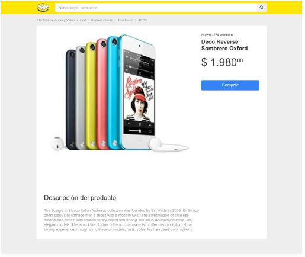

# Test práctico - frontend

Bienvenido al test práctico para aspirantes al área de front-end de Mercado Libre.

A continuación presentamos el diseño y la descripción funcional de una pequeña aplicación que será la base del trabajo que deberás desarrollar.

La aplicación consta de tres componentes principales: la caja de búsqueda, la visualización de resultados, y la descripción del detalle del producto.

Tenés que usar el siguiente stack tecnológico para construir la aplicación:  
 * Cliente:
   * HTML
   * JS (Deseable utilizar React o Backbone)
   * CSS (Deseable utilizar Sass)
* Servidor:
   * Node >= 6
   * Express

## Para resolverlo, te pedimos que tengas en cuenta:
 * Usabilidad
 * SEO
 * Performance
 * Escalabilidad

## Primero, te presentamos las vistas de las pantallas que tenés que hacer
 1. Caja de búsqueda

    
 2. Resultado de la búsqueda

    
 3. Detalle del producto

    

## Te pedimos:
 * En base a los diseños dados, construir las siguientes tres vistas:
   * Caja de búsqueda
   * Resultados de la búsqueda
   * Detalle del producto
 * Las vistas son navegables de manera independiente y cuentan con su propia url:
   * Caja de Búsqueda: `/`
   * Resultados de la búsqueda: `/items?search=`
   * Detalle del producto: `/items/:id`
 * Construir los siguientes endpoints para ser utilizados desde las vistas:
   * `/api/items?q=:query`
     * Debe consultar el siguiente endpoint: `https://api.mercadolibre.com/sites/MLA/search?q=:query` y devolver los resultados en el formato indicado:  
        ```json
        {
          "author": {
            "name": String,
            "lastname": String
          },
          "categories": [String, String, String, ...],
          "items": [
            {
              "id": String,
              "title": String,
              "price": {
                "currency": String,
                "amount": Number,
                "decimals": Number
              },
              "picture": String,
              "condition": String,
              "free_shipping": Boolean
            },
            {...},
            {...},
            {...}
          ]
        }
        ```
   * `/api/items/:id`
     * Debe consultar los siguientes endpoints: `https://api.mercadolibre.com/items/:id`, `https://api.mercadolibre.com/items/:id​/description` y devolver los resultados en el formato indicado:  
        ```json
        {
          "author": {
            "name": String,
            "lastname": String
          },
          "item": {
            "id": String,
            "title": String,
            "price": {
              "currency": String,
              "amount": Number,
              "decimals": Number,
            },
            "picture": String,
            "condition": String,
            "free_shipping": Boolean,
            "sold_quantity": Number,
            "description": String
          }
        }
        ```

## Descripción funcional de la aplicación
 * En la vista de caja de búsqueda, debería poder ingresar el producto a buscar y al enviar el formulario navegar a la vista de Resultados de búsqueda, visualizando solo 4 productos. Luego, al hacer clic sobre uno de ellos, debería navegar a la vista de Detalle de Producto.
 * Dado un id de producto, debería poder ingresar directamente a la vista de detalle de producto.

---

### Entregable
 * Repositorio en Github.
 * Enviar el link al repositorio por e-mail.

### Notas
 * La firma del json en el campo author se refiere a tu nombre y apellido. Deberás agregar esta firma en el manejo de datos entre la API y el front-end.
 * El repositorio puede ser público o privado, como prefieras.
 * No es necesario implementar la paginación, ni el filtro por categorías.
 * El breadcrumb que se muestra en el listado de búsqueda debe armarse basado en la categoría que más resultados obtuvo (dicha información está disponible en la API de Search). (Obviamente, el breadcrumb de la página de detalle del ítem debe armarse con la categoría propia del ítem).
 * Podés usar en el listado de search la imagen que devuelve la API (90x90) aunque esta se vea pixelada al estirarla para ajustarse al diseño del test. (A fines del test, no hace falta que busques la imagen en el tamaño exacto).